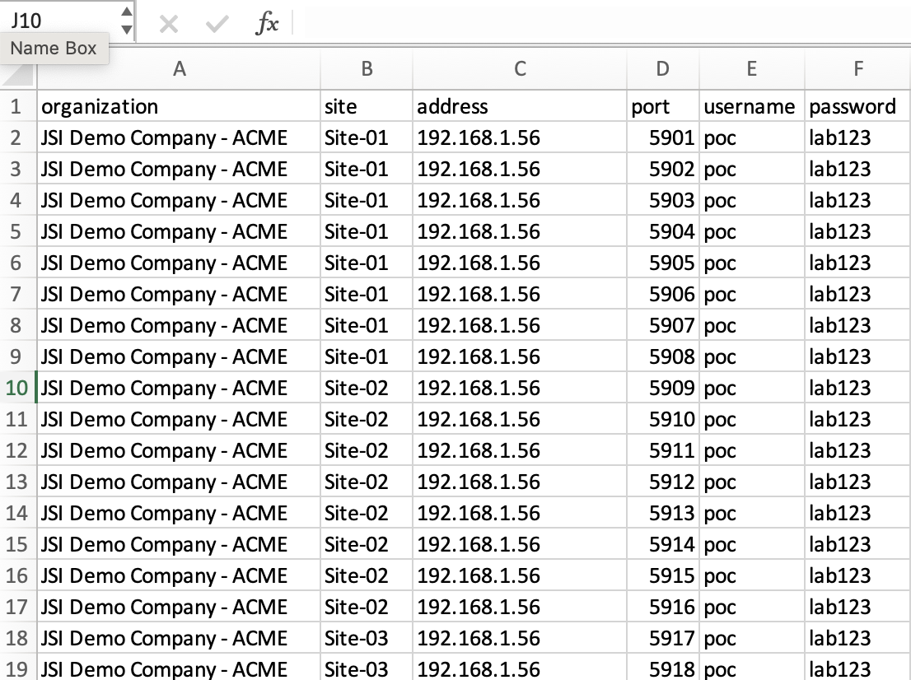

# Juniper Cloud Connection Manager (JCCM)

Juniper Cloud Connection Manager (JCCM) is a standalone application designed to automate the adoption of multiple Juniper network devices to various Juniper cloud services such as JSI, MIST, and Routing Assurance. JCCM streamlines network management, ensuring seamless integration and efficient control of your devices.

## Features

- **Automated Device Adoption:** Simplifies the process of adopting Juniper network devices to Juniper cloud services.
- **User Login and Authentication:** Secure user login process to ensure authorized access.
- **Import Inventory:** Import and manage your network device inventory with ease.
- **Get Facts:** Retrieve detailed information about your network devices, including hardware model, hostname, serial number, status, and more.
- **Adopt Devices:** Seamlessly adopt devices to desired cloud services with a few clicks.
- **Release Devices:** Easily release devices from cloud services when needed, ensuring flexible management.
- **Integrated SSH Terminal:** Optionally open an SSH terminal within the same window for direct device management.
- **User-Friendly Interface:** Intuitive UI designed to enhance user experience and simplify network cloud attachment tasks.
- **Multi-Platform Support:** Available for both Intel-based and ARM-based macOS systems and Intel-based Windows systems.
- **Network Search Support:** Network subnet search to generate an inventory file is in the tech preview stage.
- **Bastion Host Proxy Support:** Enables secure access to remote devices through a bastion host acting as a proxy.
- **Auto Update Support:** automatically checks for updates and applies them seamlessly.

## Bastion Host Proxy Support

- **Overview:** This feature enables access to target devices through a bastion host proxy, commonly referred to as a jump server. 
- **Supported Systems:** Currently, Linux machines equipped with OpenSSH server/client are supported for use as the bastion host proxy. 

### Note on Junos Machines

- While Junos machines are technically capable of functioning as bastion hosts, they are not recommended due to performance limitations and potential adverse effects on regular operations.

## Usage

To configure a Linux machine as your bastion host proxy, ensure that the OpenSSH server/client is properly set up and accessible. For guidance on configuring OpenSSH, refer to the [OpenSSH documentation](https://www.openssh.com/manual.html).

### Performance Considerations

- **Linux Machines:** Optimal for use as bastion hosts due to their robust handling of SSH connections and minimal impact on device performance.
- **Junos Machines:** Should be avoided as bastion hosts where possible to prevent degradation in the machine's core functionalities and overall performance.


## Device Adoption Demo


## Network Search Demo


## Bastion Host Proxy Demo


## Product Model Validation Demo


## Console Window for Debugging Demo


## Check Network Access Demo


## Installation

### Download

Choose the appropriate installer for your system from the options below. macOS users are recommended to use PKG installers for a more streamlined installation experience.

#### macOS

**PKG Installers** (Recommended)
- [Download for Intel-based Macs (x64)](../../releases/latest/download/jccm-darwin-x64.pkg)
- [Download for ARM-based Macs (arm64)](../../releases/latest/download/jccm-darwin-arm64.pkg)

**DMG Installers**
- [Download for Intel-based Macs (x64)](../../releases/latest/download/jccm-darwin-x64.dmg)
- [Download for ARM-based Macs (arm64)](../../releases/latest/download/jccm-darwin-arm64.dmg)

#### Windows

- [Download for Intel-based PCs (x64)](../../releases/latest/download/jccm-windows-x64-setup.exe)

#### Ubuntu

- [Download for Intel-based deb (x64)](../../releases/latest/download/jccm-linux-x64.deb)

#### Centos, Rocky, Redhat

- [Download for Intel-based rpm (x64)](../../releases/latest/download/jccm-linux-x64.rpm)

### Install

#### macOS

1. **For PKG Files:**
   - Double-click the downloaded `.pkg` file and follow the on-screen instructions.

2. **For DMG Files:**
   - Double-click the downloaded `.dmg` file.
   - Drag and drop the JCCM application into the `Applications` folder.

#### Windows

1. Double-click the downloaded `.exe` file and follow the installation wizard instructions.

#### Ubuntu

1. Run the following command. Replace ~/Downloads with the appropriate path if your file is saved in a different directory.
```bash
dpkg -i ~/Downloads/jccm-linux-x64.deb
```

#### Centos, Rocky, Redhat
1. Run the following command. Replace ~/Downloads with the appropriate path if your file is saved in a different directory.
```bash
yum -y install ~/Downloads/jccm-linux-x64.rpm
```

### Post-Installation

#### macOS Gatekeeper

- The Juniper Cloud Connection Manager (jccm) app is signed and notarized by Apple, so it should not typically face issues with macOS Gatekeeper, which are usually associated with apps from unidentified developers.

- **If an issue arises**, where macOS Gatekeeper prevents the application from running, displaying an error that the app is "damaged and can’t be opened," you can resolve this by manually removing the quarantine attribute. Open the Terminal and run the following command:
  ```bash
  xattr -cr /Applications/Juniper\ Cloud\ Connection\ Manager.app


#### Microsoft Defender SmartScreen

- The jccm app is signed with a developer certificate, yet initially, Microsoft Defender SmartScreen might still display a warning because the app is unrecognized. Over time, as more users install the application, SmartScreen will recognize it as trustworthy.

- **To proceed with installation** when faced with the SmartScreen alert:
  1. Click on **"More info"**: This reveals more details about the application.
  2. Verify **the Publisher**: Check that the publisher's name matches what you expect.
  3. Select **"Run anyway"**: This will bypass the SmartScreen alert and allow you to proceed with the installation.


## Inventory Excel File Format

To ensure proper inventory management, the Excel file must include the following mandatory fields in the headers:

- **organization**: Name of the organization
- **site**: Site location of the device
- **address**: The device’s IP address
- **port**: Port number for the SSH server in the device
- **username**: Username for device access
- **password**: Password for device access

Here is an example of how the device inventory file should be formatted:

```plaintext
| organization | site        | address         | port | username | password  |
|--------------|-------------|-----------------|------|----------|-----------|
| Org1         | Site1       | 192.168.1.1     | 22   | admin    | password1 |
| Org2         | Site2       | 10.0.0.2        | 22   | user     | password2 |
| Org3         | Headquarters| 172.16.0.1      | 22   | root     | rootpass  |
```

### Example Inventory File

Below is a visual example of how the inventory file should look:



### Instructions

1. **Create a new Excel file**: Open Excel and create a new spreadsheet.
2. **Add headers**: Add the headers `organization`, `site`, `address`, `port`, `username`, and `password` in the first row.
3. **Fill in the details**: For each device, fill in the details under the appropriate headers.
4. **Save the file**: Save the file in `.xlsx` format.


## Usage

1. **User Login:**
   - Open the JCCM application.
   - Enter your credentials and log in to the system.

2. **Import Inventory:**
   - Navigate to the "Inventory" section.
   - Click on "Import Inventory" and upload your device inventory file. Supported excel file formats - xlsx.

3. **Get Facts:**
   - Select the devices from your inventory.
   - Click on "Get Facts" to retrieve detailed information about the selected devices, including configurations, health status, and performance metrics.

4. **Adopt Devices:**
   - Choose the devices you wish to adopt.
   - Right-click on the device, site, or organization and select "Adopt Devices" to begin the adoption process.

5. **Release Devices:**
   - Select the devices you want to release.
   - Click on "Release Devices" to remove them from the selected cloud services, ensuring they are no longer managed by JCCM.

6. **Open SSH Terminal:**
   - Navigate to the "Terminal" section.
   - Select a device and open an SSH terminal within the application window for direct management and troubleshooting.

## Supported Platforms

Currently supported platforms:
- macOS (Intel x86_64 and ARM64)
- Windows (Intel x86_64)
- Linux (Intel x86_64)

## License

This project is licensed under the MIT License. See the [LICENSE](MIT-license.txt) file for more details.

